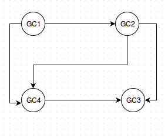

## OCSI 
### A broad overview of the OCSI idea

OCSI is a framework that infers gene regulatory network (GRN) topology of several species responding to perturbations/treatments, with the species evolving from the some common ancestor. Due to sharing this ancestor, certain genes from these species are orthologous, which results in a certain similarity between these species' GRNs. OCSI makes use of this fact, in conjunction with predictions from CSI to make improved guesses of these GRNs' topology.

CSI operates under the premise that when a particular parent gene regulates a target (child) gene, then the child's expression profile can be explained by the parent's expression profile at the preceding time point (giving the parent gene time to get its protein to the child gene's promoter and affect its expression). This is formally done by fitting a Gaussian process to a visualisation of the data where one axis is made up of the child's expression and the other axes are time shifted parents. CSI infers parents on a per-child basis, with all eligible parent combinations (up to a specified maximum number of parents) evaluated, and probabilities of each parental set being "the correct one" are computed based on how good that individual fit is. The fits are optimised through Expectation Maximisation, with the values of hyperparameters governing the behaviour of the Gaussian processes tuned to maximise the overall fit quality. CSI was applied to synthetic 10 and 100 gene networks in a comparison with several other algorithms, and performed very well [(Penfold et al., 2011)][penfold2011].

Using the outputs of CSI for several species evolving from some common ancestor, OCSI builds better network topologies with the assumption that orthologue genes will make GRN topologies of these species share a certain level of similarity. The similarity between GRNs is measured via the Weisfeiler-Lehman graph kernel (WL kernel). This similarity score and the CSI scores are two competing factors that determine the probability that a particular gene regulates another gene. The network topology is updated via a series of Gibbs updates. A more rigorous description of these algorithms is provided in [Penfold et al. 2015][penfold2015] (the Gibbs updates are described in the supplementary file).

##Test Run
- - -
You can perform an OCSI run with the aid of sample data set originally used in [Penfold et al. 2015][penfold2015] and the testing of the OCSI Python implementation. This data set is provided at `ktpolanski/ocsi_testdata` under Community Data, with the five CSV files with `csi` in their name being the CSI input and `orthologs.csv` carrying information on orthologue groups across the species.

### Input in Detail
- - -
#### CSI Input
The user is required to run CSI, whose implementation can be found on iPlant, on each individual time series data for each species. OCSI requires the CSV files generated by CSI on input. In the interest of consistency, be sure to run CSI with the same parental set depth as what you specify when you call OCSI later.

#### Orthologue File
OCSI's main advantage over other algorithms in the CSI family is that it makes use of similarity between GRNs of related species, basing on orthologous genes. Identifying orthologous gene groups can be done using other tools such as Best Reciprocal hits, OrthoMCL found in iPlant or elsewhere. Users are required to inform OCSI of orthologous genes in all provided species. 

The orthologue file is a CSV file where all gene IDs of the same orthologue group are put on the same line, with the individual gene IDs separated by commas. The file is to feature one line per orthologue group. It is fine for an orthologue group to consist of a single gene ID. **IMPORTANT:** all (distinct) gene IDs in all species must be listed in this file. We allow users the flexibility to have duplicate gene IDs if the same gene appears in different input datasets, in which case, the repeated gene ID needs to be listed only once. An example of orthologue file is provided in `orthologs.csv`. The OCSI demonstration data features 5 species, which share the same 10 genes, where each gene belongs to a separate orthologue group. Each gene ID needs to be listed exactly once. Note that genes of the same species can also potentially be orthologous. 

#### OCSI Framework
OCSI offers two different frameworks. The first framework infers the network topology by comparing the similarity between each network and a hypernetwork (possibly representative of the ancestral network from which the individual species evolved), whereas the second framework infers the network topology by comparing the similarity between every pair of networks with no hypernetwork present. Generally, framework 1 is more suitable when the user has more than 3 species and framework 2 is suitable when the user has 3 or less species as specified in [Penfold et al., 2015][penfold2015].
#### Temperature
The temperature is a decimal value dictating how strong the influence of network similarity is in updating GRNs' topology. The lower the temperature, the more similar the OCSI output is to plain CSI output. For the demonstration data (5 species with 10 genes each), framework 1 takes in temperature values up to ~10, whereas framework 2 takes in temperature value up to ~2-3.
#### Parental Set Depth
The depth of parental set is the maximum number of genes that can regulate a particular gene at the same time. **IMPORTANT:** This value has to be consistent with the parental set depth in CSI. Typically, the parental set depth is set to 2 or 3 with the former as default. Setting this value less than 2 will provide overly simple networks, which fails to reflect true information that GRNs are supposed to offer. Setting this value to be beyond 3 might take too long for computations to be performed.

#### Other Options
A range of auxiliary options are provided to refine the results of OCSI.

1. Gibbs Chain Length: the number of Gibbs sampling steps to be ran. The OCSI publication used 3000 Gibbs steps in their analyses. Default value: 1000.
2. Burn-In: the number of burn-in steps in the Gibbs chain to be discarded, accounting for the random initialisation and letting the algorithm approach a reasonable solution. Default: 100.
3. Weisfeiler-Lehman Depth: the WL kernel depth. Increasing this parameter will emphasise the similarity or difference between the compared network structures, but will also result in an increased computational load. Increasing above 2 is not recommended. Default: 1.
4. Output Prefix: the prefix of output files in a run. Default: `out`.
5. Initialization method: choosing the starting GRN of individual species. The details of these initialization methods can be found in the in-depth technical section at the end of the document: 
   1. Sample from the parental set distribution output from CSI for the relevant species.
   2. Join CSI output for all species into a "common distribution", then use this common distribution to initialize each species.

   By default, the first initialization method is recommended for framework 1, with the second one recommended for framework 2.

### Output in Detail
- - - 
#### `pppMarginalXXX.csv`
This is the primary output of OCSI, which contain the marginal matrix for species number XXX, where each target gene occupies a row of the file and the potential parents are listed as columns. The element on ith row and jth column represents the probability that the jth column parent will regulate the ith row target gene. ppp is the prefix of output file. By default, ppp is `out`.

#### `pppUtilFolder/ppp_paSet_weight_speciesXXX.csv`
Additionally, OCSI also outputs CSI-like CSV output files where the first column is a target gene id, the second column is a parental set (with parents separated by colons) and the third column is the probability that this parental set is the true parental set. If a parental set for a gene *g* is not mentioned in this file, the probability that this gene set regulates *g* is 0. When using framework 1, the user will obtain an aditional file `out_paSet_weight_hypernetwork` which contains the parental set distribution for the hypernetwork.
#### `pppUtilFolder/pppRawMCMC`
The raw recorded Gibbs chain of parental set for each gene in each species. This is only outputed for the sake of completeness, all biologically useful data is captured in marginal matrix files and parental weight files. Each line in this file has the form `species_number:gene_ID:parental_set1;parental_set2;parental_set3;...` where each individual genes within the same parental set are seperated by `,`.
#### `pppUtilFolder/ppp_species.txt`
This is a utility file that lists species name and its corresponding species number (the XXX suffix of output files). The CSI input file name is taken as species name.
### `FullOutput.tar`
The complete output of the analysis, archived into a single file for ease of downloading to your computer.

### An extra feature: inferring GRN where one or more species GRN topology is known
Another powerful usage of OCSI is to infer network topologies of species, while knowing the explicit network topology of related species. 

#### Known GRN Topology Files
OCSI accepts optional known GRN topologies as CSV file. The CSV file feature an incident list representation of the GRN. Specifically, each line in the CSV file has the format: `target_gene_ID,parent_gene_ID1,parent_gene_ID2,parent_gene_ID3,...`. The first gene is always the target gene ID, followed by a comma seperated list of gene IDs regulating the target gene.

For e.g. consider the following GRN for species 3:



Then `knownNetwork.csv` is:
```
GC1
GC2,GC1
GC3,GC2,GC4
GC4,GC2,GC1
```
The order of lines or parent gene IDs are not important.

[penfold2011]: http://rsfs.royalsocietypublishing.org/content/1/6/857.short

[penfold2015]: https://bioinformatics.oxfordjournals.org/content/31/12/i97.full.pdf


[shervashidze2011]: http://is.tuebingen.mpg.de/fileadmin/user_upload/files/publications/2012/shervashidze11a.pdf


