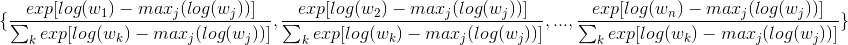

##Technical Side of OCSI Algorithms
For folks who are keen to look into the internal Python implementation, this section will provide some important descriptions of architecture, tweaks, cut-corners and so forth in the Python code. If you are only after the usage of OCSI, you are good to start using it without reading through this section.

### Brief comments on the mathematics of OCSI 
For each species, their GRNs are initialized from the parental set probability distribution provided by CSI output. This topology is updated via a series of Gibbs update to provide a final sample of parental set for each gene in each species. The rigorous derivation is provided in the [Penfold et al. 2015][penfold2015].
In general, the Gibbs update formulae for a gene ith in species jth has the form (slightly modified from the publication):


In this notation, *G*<sup>(k)</sup> is the GRN of the *k*th species and *G*<sup>(j)</sup><sub>*Pa*<sup>(j)</sup><sub>i</sub></sub> is the GRN of the *j*th species where the parental set of the gene *i*th is set to be *Pa*<sup>(j)</sup><sub>i</sub>

Notice that K(G<sup>1</sup>,G<sup>2</sup>,...,G<sup>n</sup>) are values from the WL graph kernel described below and the probability P(X<sub>i</sub><sup>(j)</sup>| Pa<sub>i</sub><sup>(j)</sup>, &theta;<sub>i</sub><sup>(j)</sup>) is the plain CSI weight output for parental set Pa<sub>i</sub><sup>(j)</sup> for gene ith in species jth.

E<sub>0</sub> is described in the paper. However, given a fixed temperature, the exp(-&beta; E<sub>0</sub>) terms on both the top and the bottom cancel out, giving the fomula as:


Since K(G<sup>1</sup>,G<sup>2</sup>,...,G<sup>n</sup>) can become large, the exponential term can become large causing numerical instability. Therefore, we use the following trick: given n very numerically unstable (unormalised) weights that we cannot compute {w<sub>1</sub>,w<sub>2</sub>,...,w<sub>n</sub>}, their normalised weight distribution is the same as:



In OCSI case, the individual log terms are equivalent to sum of log of CSI weight and -&beta;K(G<sup>1</sup>,G<sup>2</sup>,...)
### Introduction to Weisfeiler-Lehman graph kernel
Network similarity in OCSI is measured by Weisfeiler-Lehman kernel with depth 1. For an indepth discussion for this graph kernel, please refer to [Shervashidze at el. 2011][shervashidze2011]. Since the kernel was designed for undirected graphs while GRNs are directed, there are 2 important modifications:

1. When Shervashidze refers to neighbours, we use the parent gene of the current gene.
2. A gene always regulates itself, therefore, when Shervashidze refers to 'for a node, get the set of all neighbours', the OCSI translation will be 'for a gene, get all parental genes and the current gene itself'.

The psuedo-code for this algorithm in glorious detail is as followed:
```
Procedure: ComputeWLKernel
Input: networkList
Output: WL score
```
```
fvectors = [];
alphabet = set of all label values in all network;

//initialize the feature vector for each network
for each network in networkList:
	temp = zero array with size of length(alphabet).
	for each letter in alphabet:
		count the number of time this letter appear as label 
		in current network and write this value into the corresponding
		element in temp. 
	put temp at the end of fvectors; //fvectors now has another array

//relabeling iteration
Repeat h times:
	hashmap = {};
	currrentNewLetter = max(alphabet) + 1
	for each network:
		for each gene g in the network:
			pa = get all parental genes of g  //(including g in pa)
			palabel = the multiset of all labels of each element of pa
			sort palabel
			currLabel = current label of g
			for each pl in palabel:
				append pl at the end of currLabel
			if currLabel is not a key in hashmap:
				hashmap[currLabel] = currentNewLetter;
				currentNewLetter = currentNewLetter + 1;
			set hashmap[currLabel] to be label of g
	alphabet = set of all current labels in all network;
	i = 0
	while i less than no_of_Network
		temp = zero array with size of length(alphabet).
		for each letter in alphabet:
			count the number of time this letter appear as label 
			in current network and write this value into the corresponding
			element in temp. 
		merge temp into fvectors[i] // fvectors still has the same number of array, but fvector[i] is now longer
		i = i + 1
compute total WL score.
```
Computing WL score from any two feature vectors (of two different graphs) is simply taking the dot product of these two feature vectors.
* For framework 1, the total similarity score of `n` species is:
```
score = 0;
hv = feature vector of hypernetwork;
for v in fvectors:
	if v is not the feature vector of hyper net:
		score =  score + dot_product(v,hv)
return score;
```
* For framework 2, the total similarity score of `n` species is:
```
score = 0;
i = 0;
while i less than length(fvectors):
	j = i + 1;
	while j less than length(fvectors):
		score = score + dot_product(fvectors[i],fvectors[j]);
		j = j + 1;
	i = i + 1;
return score;
```

**NOTE:** Varying the value of *h* (number of times to relabel) will change the temperature scale. The paper indicates that a suitable *h* value is 2 **where h=1 means there is no relabeling**. In the Python implementation, we set h=1 where **h=0 means there is no relabeling**.

### Hyper network in OCSI 
   Framework 1 in OCSI uses a hypernetwork. A hypernetwork in OCSI is a network where each vertex corresponds to a unique node label in all GRNs input (there exists a bijection between Union{*Li* }, *i* &isin;*{1,2,3,4...,no_species}* and *V* where *Li* is the set of all vertex labels in the ith species and *V* is the set of hypernodes). The edges in hypernetwork will be inferred by OCSI.
   
### Architecture of OCSI Python implementation
   


Note: the white arrow head means a child class extends a super class whereas the normal arrow from class A to class B means class A contains an object of class B in its list of fields.

#### A brief guide to OCSI Python architecture
The most important classes in this programs are `Gene`, `RandomVariable` (and its derived classes: `ParentSetRVFw1`, `ParentSetRVFw2`, `ParentSetStarRV`) and `AbstractGibbs`. 

Initializing a Gene object by calling `gene = Gene(gene_label, gene_id, species_id )`. `gene_id` can be string or integer, but `gene_label` has to be integer. Initially, the gene will have no parents or child. Note that the children gene list is referred to in the code as as "neighbours" (bad terminology given how we have established in the WL kernel section that when WL kernel paper calls for neighbour vertices, we call for parent genes).

`RandomVariable` object requires inputs about current value, list of possible values (a list of all possible lists of genes that can be the parental gene set of the current gene). Normalization option has to be enabled in OCSI. Other information such as WL kernel depth, temperature beta etc. ... can be looked up in the code for constructors in the file `OCSIUtilities.py`.

##### What happens when OCSI starts running:

When `AbstractGibbs.sample(no_iteration)` is called (this is the git of the main function), it will call `AbstractGibbs.gibbsUpdate()` repeatedly to compute the Gibbs chain. Inside `gibbsUpdate()`, each `RandomVariable` is used sequentially to compute its parental set probability distribution. This is done via 2 steps:

   1. `RandomVariable` object calls its function `getConditionalDistribution()`, which in terns, loops through all possible values for this random variable (in our case, looping through all possible parental sets) and compute the probability of this parental set (see section on mathematics of OCSI). Note that since we cannot compute the exponential of the graph kernel score directly, we will store the corresponding pair `[kernelscore, CSI_weight]` into the corresponding place for this value in the `RandomVariable`'s  `distribution` array. 

   2. After having a "psuedo" `distribution` array for all possible values, the `RandomVariable` object calls function `normalizeDistribution()` to put the two pieces of information together as described in the mathematics section to form a normalized weight distribution for each parental set value, from which we can sample a parental set for the current `RandomVariable` before moving on to repeat the process with the next `RandomVariable`. 

Note that the function `setCurrentValue()` used to set the value of the `RandomVariable` object will call `updateAfterSettingValue(current_value)`, which will essentially update the GRN topology.

Note: all `db` objects are for debugging purposes, not important, developers can safely ignore those.


[penfold2011]: http://rsfs.royalsocietypublishing.org/content/1/6/857.short

[penfold2015]: https://bioinformatics.oxfordjournals.org/content/31/12/i97.full.pdf

[shervashidze2011]: http://is.tuebingen.mpg.de/fileadmin/user_upload/files/publications/2012/shervashidze11a.pdf
